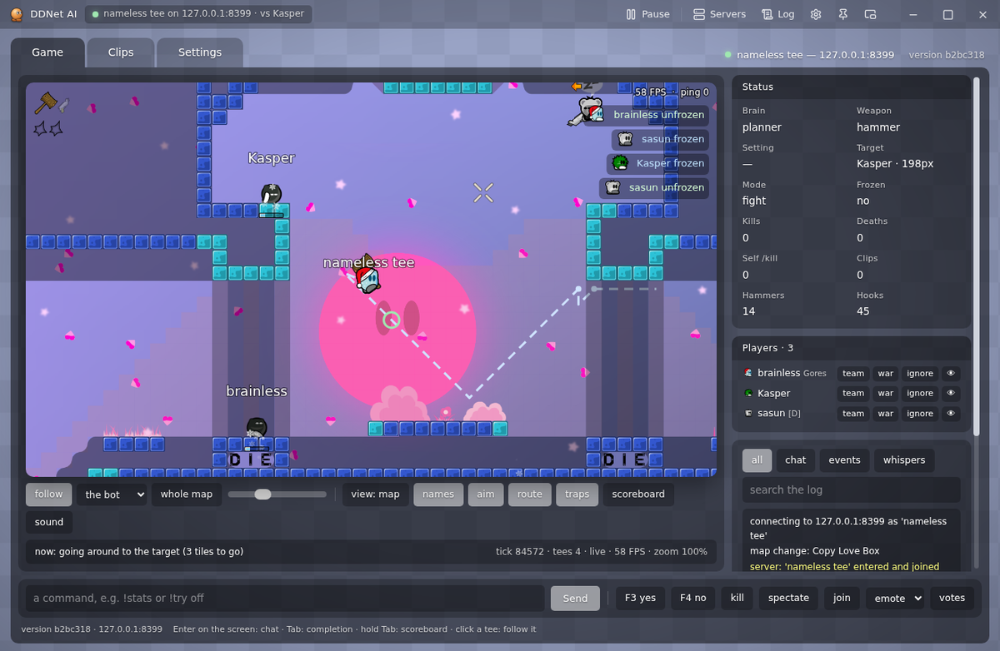
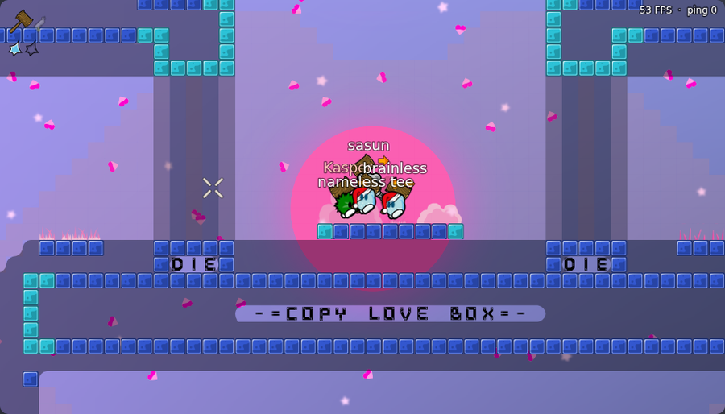
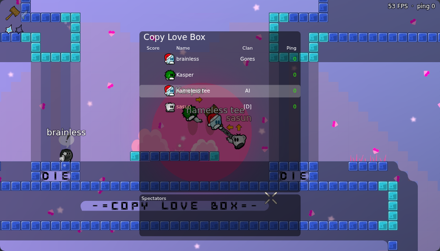
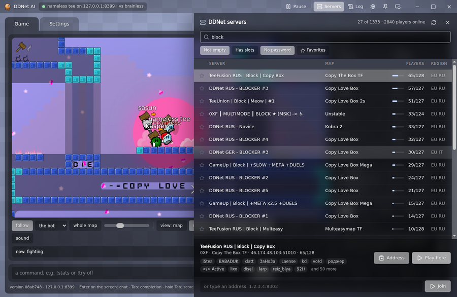
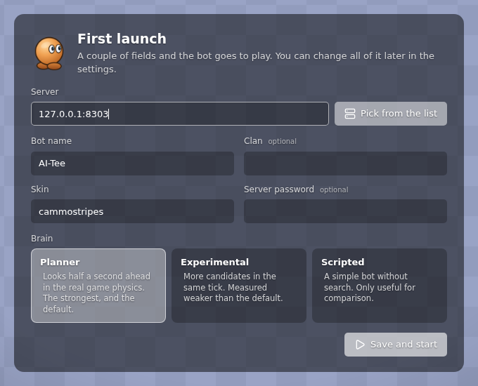
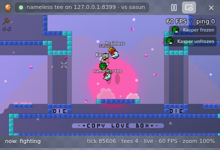

# DDNet AI

**A bot that plays block in DDNet by itself**

It throws the hook, swings the hammer, puts opponents into freeze and gets itself out of it. 
Every move is checked in the game's real physics, 25 times a second.

[Русский](README.md) · **English** · [Project page](https://wranked1.github.io/DDNet-AI/)

[Quick start](#quick-start) · [The window](#the-window) · [How it plays](#how-it-plays) · [Controls](#controls) · [FAQ](#faq)

## Quick start

1. Download **`ddnet-ai.zip`** from the [latest release](https://github.com/Wranked1/DDNet-AI/releases/latest) and unpack it anywhere.
2. Double-click **`DDNet AI.exe`**.

Nothing else to install: the window and Node.js are inside. The window restarts the bot if it falls over, and keeps it updated.

> [!NOTE]
> `DDNet AI.exe` is not code-signed, so the first time Windows may show "Windows protected your PC". Click "More info", then "Run anyway".

The bot asks for its name, clan and skin, then goes to play. The server field can stay empty: the bot then joins the liveliest block server without a password by itself, and moves on when that one empties. The answers are saved in `settings.json`, and next time it joins the server by itself.

The window speaks English or Russian: it follows the system, and the language is also a setting (Settings, App, Language). The bot's page, its replies and its console follow the window.

<b>Linux and macOS</b>

 

Install [Node.js](https://nodejs.org) 24 or newer and run `./run.sh` in the bot's folder. The bot's page opens in the browser at `http://localhost:7777`, and you can type commands in the console. The desktop window is built for Windows only so far.

## The window

<table>
  <tr>
    <td width="50%"></td>
    <td width="50%"></td>
  </tr>
  <tr>
    <td align="center">The game in DDNet's graphics: skins, hook, freeze, names over the players</td>
    <td align="center">Scoreboard, freeze feed, ping</td>
  </tr>
  <tr>
    <td></td>
    <td></td>
  </tr>
  <tr>
    <td align="center">DDNet servers, searchable by map, mode and player name</td>
    <td align="center">First launch: a couple of fields and the bot goes to play</td>
  </tr>
</table>

- **The game as in the client.** The map, skins, hook, hammer and emotes are drawn with the graphics of your own DDNet install. The camera follows the bot or any player.
- **Servers.** The whole DDNet list with search, filters and favorites. "Play here" moves the bot to the chosen server.
- **Pause from anywhere.** From the window, the tray, the taskbar thumbnail and with <kbd>Ctrl</kbd>+<kbd>Shift</kbd>+<kbd>F9</kbd> from any program, even from the game itself.
- **Team, war and ignore.** Every player on the server has buttons: "team" (the bot leaves them alone), "war" (it always goes for them), "ignore" (it neither touches nor answers them). The same lists as `!friend`, `!war` and `!ignore`.
- **Keys for the bot.** <kbd>F3</kbd> and <kbd>F4</kbd> vote for it, and buttons make it `/kill`, go to the spectators, show an emote or call a server vote.
- **Mini mode.** A small window on top of everything, to watch the bot while you play yourself.
- **Log and notifications.** The bot disconnected, came back, updated: the window tells you.
- **An archive for review.** "Collect an archive for Claude" puts the clips, map memory and the demos you pick into one zip on the desktop. The server password stays out of it.

 Mini mode over the game

## How it plays

The bot keeps its own copy of DDNet 20 physics and on every step runs dozens of options half a second ahead in it: where to run, when to jump, where and when to throw the hook, when to hit. It picks the one after which the opponent is closer to freeze and the bot itself is further from it.

| | |
|---|---|
| **Hooks from a distance** | throws the hook from afar, like strong players do, instead of walking up close |
| **Holds and drags** | leads the opponent on the hook to the freeze and finishes with the hammer |
| **Minds its ping** | rolls the world forward by its own delay, counting the keys already on their way to the server |
| **Picks its target** | does not stick to someone already frozen when a free one is nearby |
| **Gets out by itself** | if it is stuck in freeze and nobody saves it, it does `/kill` |

> [!NOTE]
> The bot does not look at the screen and presses nothing for you. It is a separate player: it joins the server by itself, like a normal client, and you can play DDNet on the same computer at the same time.

## Controls

| Keys | What they do |
|---|---|
| <kbd>Ctrl</kbd>+<kbd>Shift</kbd>+<kbd>F9</kbd> | pause and resume from any program (can be changed in the settings) |
| <kbd>F3</kbd>, <kbd>F4</kbd> | vote yes / no for the bot, while the bot's window is focused |
| <kbd>Esc</kbd> | close the servers or settings panel |
| double-click the title bar | maximize the window |

<b>Bot commands</b>

 

Typed into the window's command line or into the console. They never reach the game chat. Anything typed without `!` the bot says in the chat under its own name.

| Command | What it does |
|---|---|
| `!stop`, `!go` | stop / carry on |
| `!mode fight`, `passive`, `hold` | fight / touch nobody / hold the position |
| `!target <name>`, `!target -` | fight only this player / clear it |
| `!war <name>`, `!friend <name>`, `!ignore <name>` | always hit / never touch / never touch and never answer |
| `!clanwar <clan>`, `!clanfriend <clan>` | the same by clan |
| `!home <x> <y>` | where to go back to when there is nobody to fight |
| `!goto tele`, `!goto <x> <y>` | walk to the teleporter or to a point |
| `!clip [note]` | save the last 30 seconds of the game to a file |
| `!stats`, `!where` | counters / where the bot is and whom it fights |
| `!emote <name>` | show an emote |
| `!yes`, `!no`, `!votes`, `!vote <name>` | vote like F3 / F4, list the server's votes, call one |
| `!spec`, `!join` | go to the spectators / back into the game |
| `!kill`, `!reset` | kill itself and respawn |
| `!lang en`, `!lang ru` | the language of the console and the bot's page |
| `!quit` | quit |

## Updates

Nothing to do. The bot checks for a new version when it starts and every five minutes after, downloads it and restarts by itself, and the window updates with it. Settings, clips and map memory are left alone.

## FAQ

<b>The bot jumped into freeze by itself or plays strangely. How can I help?</b>

 

Click the tray icon and choose "Collect an archive for Claude". A zip with the clips that show what went wrong appears on the desktop. If you recorded a demo, add it too.

<b>Does it need a graphics card?</b>

 

No. The bot thinks on the processor, and any graphics card is enough for the window.

<b>A server with a password?</b>

 

Type the password at the first launch or in the settings. It is kept only on your computer and is cleared when you move to another server.

<b>Where are the settings and recordings?</b>

 

| Path | What is there |
|---|---|
| `settings.json` | server, name, clan, skin, language |
| `runs/clips` | recordings of moments from the game |
| `runs/memory` | what the bot remembers about maps |
| `app-win` | the window itself (Electron), which `DDNet AI.exe` opens |

## Credits

- [DDNet](https://ddnet.org) and Teeworlds: the bot's physics is ported from the DDNet 20 sources (zlib license), and the window takes the graphics and sounds from your install of the game. The screenshots show DDNet graphics (CC-BY-SA 3.0).
- [Electron](https://www.electronjs.org) (MIT) and [Lucide](https://lucide.dev) icons (ISC).
