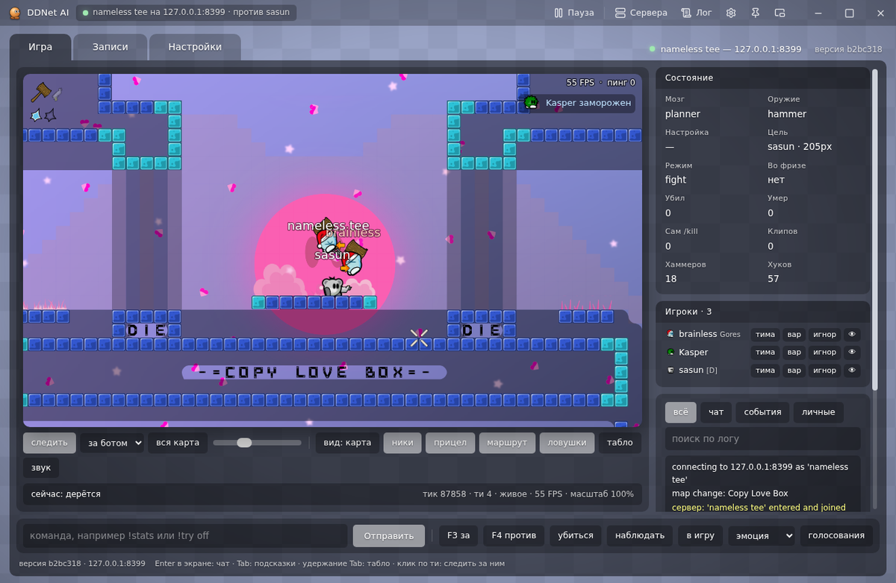
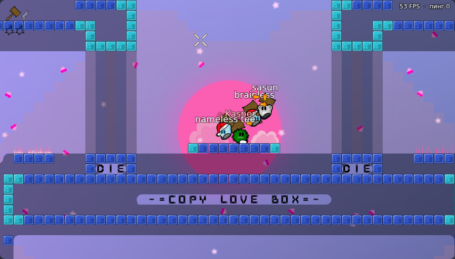
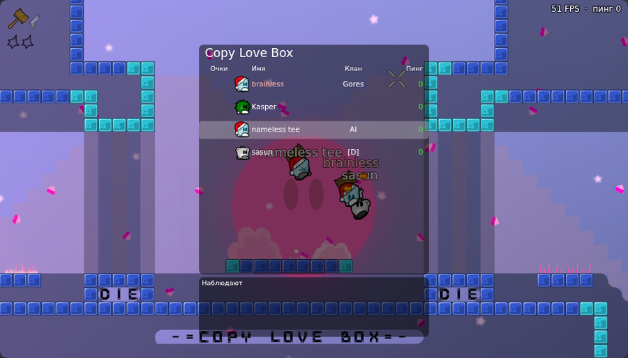
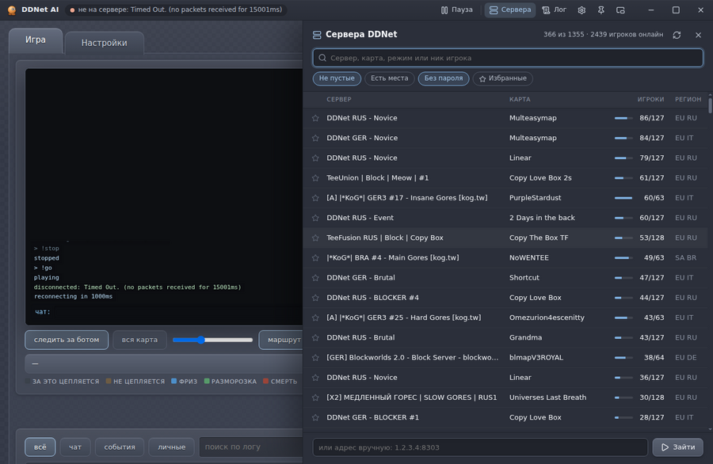
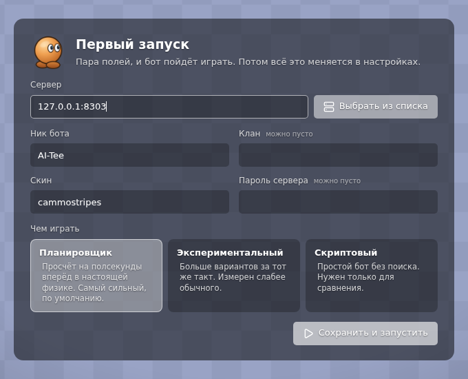
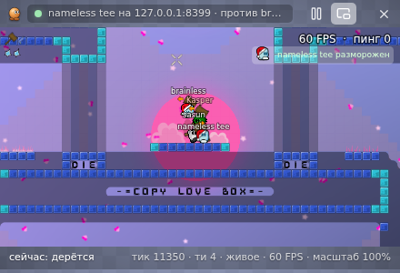

# DDNet AI

**Бот, который сам играет в блок в DDNet**

Кидает хук, бьёт молотом, закидывает соперников во фриз и выбирается из него. 
Каждый ход он проверяет в настоящей физике игры, 25 раз в секунду.

**Русский** · [English](README.en.md) · [Сайт проекта](https://wranked1.github.io/DDNet-AI/)

[Быстрый старт](#быстрый-старт) · [Окно](#окно) · [Как он играет](#как-он-играет) · [Управление](#управление) · [Вопросы](#вопросы)

## Быстрый старт

1. Скачай **`ddnet-ai.zip`** из [последнего релиза](https://github.com/Wranked1/DDNet-AI/releases/latest) и распакуй в любую папку.
2. Дважды щёлкни **`DDNet AI.exe`**.

Больше ничего ставить не нужно: окно и Node.js уже внутри. Окно само перезапускает бота, если тот упал, и обновляет его.

> [!NOTE]
> У `DDNet AI.exe` нет цифровой подписи, поэтому в первый раз Windows может показать «Система Windows защитила ваш компьютер». Нажми «Подробнее», затем «Выполнить в любом случае».

Бот спросит сервер, ник, клан и скин, а потом пойдёт играть. Ответы сохраняются в `settings.json`, и в следующий раз он зайдёт на сервер сам.

Окно говорит по-русски и по-английски: язык берётся из системы и меняется в настройках (Настройки, Приложение, Язык). Страница бота, его ответы и консоль переходят на тот же язык.

<b>Linux и macOS</b>

 

Поставь [Node.js](https://nodejs.org) 24 или новее и запусти `./run.sh` из папки бота. Страница бота откроется в браузере на `http://localhost:7777`, а в консоли можно писать команды. Окно-приложение пока собирается только для Windows.

## Окно

<table>
  <tr>
    <td width="50%"></td>
    <td width="50%"></td>
  </tr>
  <tr>
    <td align="center">Игра в графике DDNet: скины, хук, фриз, ники над игроками</td>
    <td align="center">Таблица игроков, лента заморозок, пинг</td>
  </tr>
  <tr>
    <td></td>
    <td></td>
  </tr>
  <tr>
    <td align="center">Сервера DDNet с поиском по карте, режиму и нику игрока</td>
    <td align="center">Первый запуск: пара полей, и бот идёт играть</td>
  </tr>
</table>

- **Игра как в клиенте.** Карта, скины, хук, молот и эмоции рисуются графикой из твоей установки DDNet. Камера следит за ботом или за любым игроком.
- **Сервера.** Весь список DDNet с поиском, фильтрами и избранным. Кнопка «Играть здесь» переносит бота на выбранный сервер.
- **Пауза отовсюду.** Из окна, из трея, с миниатюры в панели задач и клавишами <kbd>Ctrl</kbd>+<kbd>Shift</kbd>+<kbd>F9</kbd> из любой программы, даже из самой игры.
- **Тима, вары и игнор.** У каждого игрока сервера кнопки: «тима» (бот его не трогает), «вар» (бьёт всегда), «игнор» (не трогает и не отвечает). Те же списки, что у `!friend`, `!war` и `!ignore`.
- **Кнопки за бота.** <kbd>F3</kbd> и <kbd>F4</kbd> голосуют за него, кнопками он делает `/kill`, уходит в наблюдатели, показывает эмоцию или ставит голосование сервера.
- **Мини-режим.** Маленькое окно поверх всех, чтобы смотреть за ботом, пока играешь сам.
- **Лог и уведомления.** Бот отключился, вернулся на сервер, обновился: окно скажет.
- **Архив для разбора.** Кнопка «Собрать архив для Claude» складывает клипы, память карт и выбранные демки в один zip на рабочем столе. Пароль сервера туда не попадает.

 Мини-режим поверх игры

## Как он играет

Бот держит у себя копию физики DDNet 20 и на каждом шаге прогоняет в ней десятки вариантов на полсекунды вперёд: куда бежать, когда прыгнуть, куда и когда кинуть хук, когда ударить. Выбирает тот, после которого соперник ближе к фризу, а сам бот дальше от него.

| | |
|---|---|
| **Хук с дистанции** | кидает хук издалека, как сильные игроки, а не подходит вплотную |
| **Держит и тащит** | ведёт соперника на хуке к фризу и добивает молотом |
| **Учитывает пинг** | прокручивает мир вперёд на свою задержку, с учётом нажатий, которые уже летят на сервер |
| **Выбирает цель** | не держится за уже замороженного, когда рядом есть свободный |
| **Выбирается сам** | если застрял во фризе и никто не спасает, делает `/kill` |

> [!NOTE]
> Бот не видит экран и ничего не нажимает за тебя. Это отдельный игрок: он заходит на сервер сам, как обычный клиент, и ты можешь в это время играть в DDNet на том же компьютере.

## Управление

| Клавиши | Что делают |
|---|---|
| <kbd>Ctrl</kbd>+<kbd>Shift</kbd>+<kbd>F9</kbd> | пауза и продолжение из любой программы (меняется в настройках) |
| <kbd>F3</kbd>, <kbd>F4</kbd> | голос за / против от бота, когда окно бота в фокусе |
| <kbd>Esc</kbd> | закрыть панель серверов или настроек |
| двойной щелчок по заголовку | развернуть окно |

<b>Команды бота</b>

 

Пишутся в строке команд окна или в консоли. В игровой чат они не уходят. Всё, что написано без `!`, бот скажет в чат от своего имени.

| Команда | Что делает |
|---|---|
| `!stop`, `!go` | остановиться / продолжить |
| `!mode fight`, `passive`, `hold` | драться / никого не трогать / держать позицию |
| `!target <ник>`, `!target -` | драться только с этим игроком / снять |
| `!war <ник>`, `!friend <ник>`, `!ignore <ник>` | бить всегда / не трогать / не трогать и не отвечать |
| `!clanwar <клан>`, `!clanfriend <клан>` | то же по клану |
| `!home <x> <y>` | куда возвращаться, когда драться не с кем |
| `!goto tele`, `!goto <x> <y>` | дойти до телепорта или до точки |
| `!clip [заметка]` | сохранить последние 30 секунд игры в файл |
| `!stats`, `!where` | счётчики / где бот и с кем дерётся |
| `!emote <имя>` | показать эмоцию |
| `!yes`, `!no`, `!votes`, `!vote <имя>` | голос как F3 / F4, список голосований сервера, поставить одно |
| `!spec`, `!join` | в наблюдатели / обратно в игру |
| `!kill`, `!reset` | убиться и возродиться |
| `!lang ru`, `!lang en` | язык консоли и страницы бота |
| `!quit` | выйти |

## Обновление

Ничего делать не нужно. Бот проверяет новую версию при запуске и дальше раз в пять минут, скачивает её и перезапускается сам, а окно обновляется вместе с ним. Настройки, записи и память карт при этом не трогаются.

## Вопросы

<b>Бот сам прыгнул во фриз или играет странно. Как помочь?</b>

 

Щёлкни значок в трее и выбери «Собрать архив для Claude». На рабочем столе появится zip с клипами, в которых видно, что пошло не так. Если писал демку, добавь её туда же.

<b>Нужна ли видеокарта?</b>

 

Нет. Бот считает на процессоре, окну хватает любой видеокарты.

<b>Сервер с паролем?</b>

 

Впиши пароль при первом запуске или в настройках. Он хранится только на твоём компьютере и стирается, когда переходишь на другой сервер.

<b>Где настройки и записи?</b>

 

| Путь | Что там |
|---|---|
| `settings.json` | сервер, ник, клан, скин, язык |
| `runs/clips` | записи моментов игры |
| `runs/memory` | что бот запомнил о картах |
| `app-win` | само окно (Electron), его запускает `DDNet AI.exe` |

## Благодарности

- [DDNet](https://ddnet.org) и Teeworlds: физика бота перенесена из исходников DDNet 20 (лицензия zlib), а графику и звуки окно берёт из твоей установки игры. На скриншотах графика DDNet (CC-BY-SA 3.0).
- [Electron](https://www.electronjs.org) (MIT) и значки [Lucide](https://lucide.dev) (ISC).
